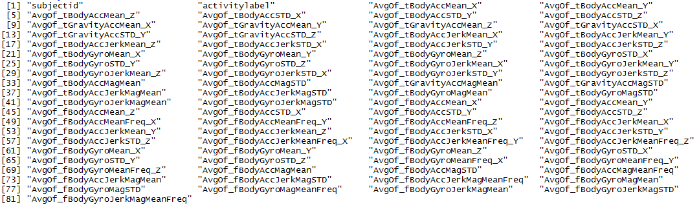

Codebook for J.Butler's Tidy Data Set
========================================================
(Coursera "Getting and Cleaning Data", June 2014)
--------------------------------------------------------

### The Human Activity Recognition Using Smartphones Dataset (UCI HAR Dataset)
The UCI HAR Dataset was developed by researchers at the Smartlab - Non Linear Complex Systems Laboratory in Genoa, Italy [1].  It consists of recorded measurements from a Samsung Galaxy S II smartphone worn on the waist by 30 volunteers aged 19-48 years as they performed the 6 activities of laying, sitting, standing, walking, walking down, and walking up.  

Using an embedded accelerometer and gyroscope that captured 3-axial linear acceleration and 3-axial angular velocity at a constant rate of 50Hz, the smartphone device acts as an inertial sensor that measures a person's movements in terms of the body'slinear acceleration (a change in inertia in at least one plane of movement, along with a gravitational component that determines orientation with respect to earth's gravity) and angular velocity (rotation).  These recordings allow body motion to be analyzed in 3 dimensions - vertically (up/down), medio-laterally (side-to-side), and anterio-posteriorly (forwards/backwards). [2]

As described on UCI Machine Learning Repository website [3], "the sensor signals (accelerometer and gyroscope) were pre-processed by applying noise filters and then sampled in fixed-width sliding windows of 2.56 sec and 50% overlap (128 readings/window). The sensor acceleration signal, which has gravitational and body motion components, was separated using a Butterworth low-pass filter into body acceleration and gravity. The gravitational force is assumed to have only low frequency components, therefore a filter with 0.3 Hz cutoff frequency was used. From each window, a vector of features was obtained by calculating variables from the time and frequency domain."

The UCI HAR Dataset was partitioned into two sets with 70% of the subjects in the training data and 30% in the test data. 

### Coursera Data Files
The following data files, available through the Coursera "Getting and Cleaning Data" course, were downloaded from 
https://d396qusza40orc.cloudfront.net/getdata%2Fprojectfiles%2FUCI%20HAR%20Dataset.zip on June 21, 2014.

* The "subject_train.txt" and "subject_test.txt" files contained the training subject ID's and the test subject ID's respectively.
* The "X_train.txt"" and "X_test.txt" files contained the study data in the form of 7352 observations (training subjects) and 2947 observations (test subjects) on 561 variables V1 through V561 (which were the data derived from the sensor signals).
* The "y_train.txt"" and "y_test.txt" files contained the activity code (what each subject was doing at the data collection timepoint)
* The "activity_labels.txt" and "features.txt" provided the description labels for the 6 activity codes and the 561 variable codes respectively.

Additional files "README.txt" and "features_info.txt" provided information the research and about the selected variables in the UCI HAR Dataset.
  
### J.Butler's Tidy Data Set

#### Methodology
The course project required that students [4]
   
1. Merge the training and the test sets to create one data set
2. Extract only the measurements on the mean and standard deviation for each measurement  
3. Uses descriptive activity names to name the activities in the data set  
4. Appropriately label the data set with descriptive variable names  
5. Create a tidy data set with the average of each variable for each activity and each subject  

#### Final Tidy Data Set
The final "tidy data" set consists of 180 rows (6 activities x 30 subjects) and 81 columns (see below).  
   

For each subjectid and activitylabel (LAYING, SITTING, STANDING, WALKING, WALKING_DOWNSTAIRS, WALKING_UPSTAIRS), there are 79 columns containing the averages of the measurements.

**Notes on variable names:**    

variable name element | description   
------------- | -------------   
t             | this prefix denotes a time domain signal    
f             | this prefix denotes a frequency domain signal
_X, _Y, _Z    | these suffixes indicates one of the triaxial planes
Mag           | magnitude of the signals calculated using the Euclidian norm
BodyAcc       | body acceleration signal   
BodyAccJerk   | body linear acceleration signal  
GravityAcc    | gravity acceleration signal  
std           | standard deviation

### References
1. Davide Anguita, Alessandro Ghio, Luca Oneto, Xavier Parra and Jorge L. Reyes-Ortiz. Human Activity Recognition on Smartphones using a Multiclass Hardware-Friendly Support Vector Machine. International Workshop of Ambient Assisted Living (IWAAL 2012). Vitoria-Gasteiz, Spain. Dec 2012

2. Queensland Sports Technology Cluster "Inertial Sensors in Sports (accelerometers and gyroscopes)" Page. URL: http://www.qsportstechnology.com/sports-engineering/inertial-sensors-in-sports.  Accessed 6/20/2014. Queensland Sports Technology Cluster, Griffith University, Brisbane Australia.

3. UCI HAR Dataset webiste on the UCI Machine Learning Repository.  URL: http://archive.ics.uci.edu/ml/datasets/Human+Activity+Recognition+Using+Smartphones.  Accessed 6/21/2014. 

4. Coursera "Getting and Cleaning Data" website. URL: https://class.coursera.org/getdata-004/human_grading/view/courses/972137/assessments/3/submissions.  Accessed 6/21/2014.
